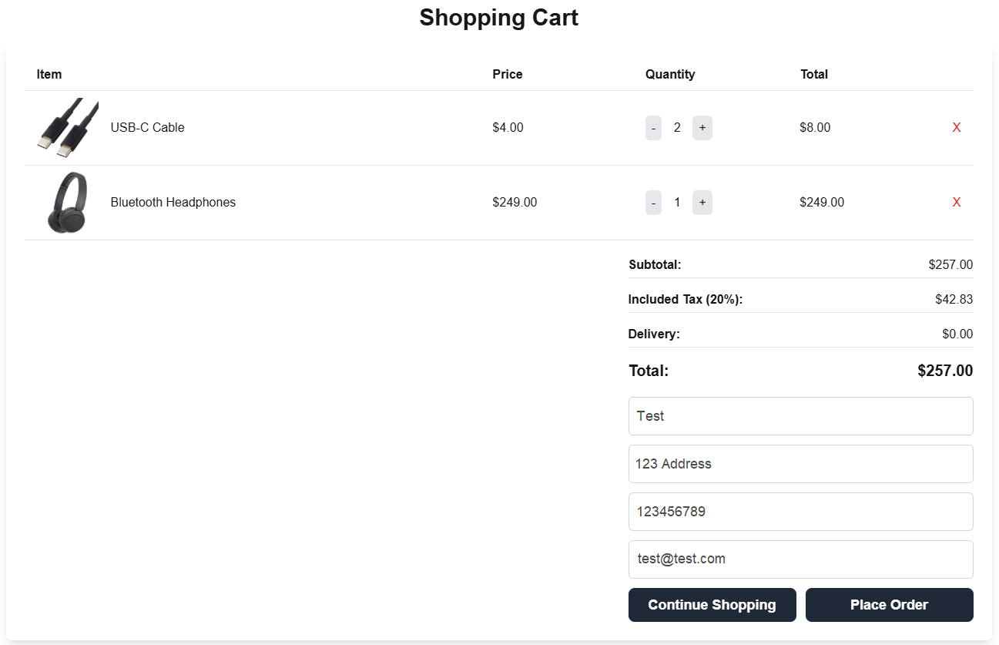
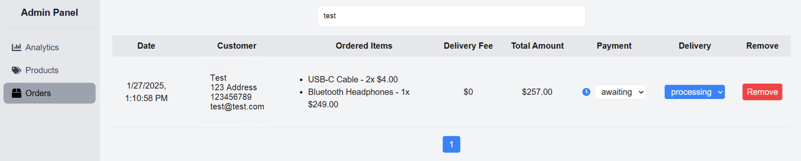

# Electronics Store Web App

A full-stack e-commerce web application for browsing and purchasing electronics. Built with modern technologies like **Next.js**, **Node.js**, **Express**, and **MongoDB**, it features a dynamic frontend, secure backend, and sleek styling.

This software can serve as a framework for implementing similar projects. With a few modifications it can be used as a general purpose e-commerce application.

---

## Contents

- [Features](#features)
- [System Architecture](#system-architecture)  
- [Tech Stack](#tech-stack)  
- [Getting Started](#getting-started)   
- [Screenshots](#screenshots)  

---

## Features

- Browse products with images, prices, and categories
- Add items to cart and manage quantities
- Placing an order
- Responsive UI using Tailwind CSS
- Admin authentication using JWT
- Admin panel for managing products, orders, and viewing analytics
- RESTful API
- MongoDB for storing product and order data

---

## System Architecture

The client-server architecture is used. The application is divided into two main parts: frontend and backend.

• Frontend: Implemented using Next.js framework and React library, it is responsible for the user interface, user interaction and data display. The frontend communicates with the backend via HTTP requests using Axios. One part of Next.js runs on the server, and the other part in the browser on the client device (React hydration).

• Backend: Built using the Express.js framework, it provides API endpoints for working with the database and performs business logic. The backend processes requests, authenticates the administrator, validates data and manages the non-relational MongoDB database using the MongoDB driver.

<div align="center">
  
</div>


The most important functionality of the application is creating an order, which can be shown with an UML sequence diagram:

<div align="center">
  
</div>


The database is non-relational, implemented in MongoDB and consists of two main collections:
1. Products – Information about products.
• Fields: unique identifier (id), name (name), category, price, image link (imageUrl), version control (v).
2. Orders – Records user orders.
• Fields: unique identifier (id), date, array of products (items) with quantity, total amount, customer name, address, phone, email address, payment status, delivery status, version control (v).

The connection between the order and product collections is not achieved through explicit foreign keys, as is the case with relational databases, but rather through referential identifiers. In the orders collection, reference to products in the array is enabled through the unique identifier (id field) of the product itself. The cardinality between collections is 1:n (one to many), so one order can have multiple products.
A version control field is assigned automatically and is used to track the version of the document when it is updated, which becomes useful in scenarios where multiple users or processes can update the same document at the same time. This prevents conflicts and unwanted changes to the document.

---

## Tech Stack

### Frontend
- **Next.js** – Framework supporting server-side rendering (SSR) and client-side rendered React app (CSR)
- **React** – UI components and state management  
- **Tailwind CSS** – Utility-first CSS for styling  
- **Axios** – For making HTTP requests
- **Nookies** – Cookie handling for Next.js apps
- **Chart.js** – For building interactive charts and visualizations
- **React Toastify** – Toast notifications for alerts and messages
- **React Icons** – Collection of popular icon libraries

### Backend
- **Node.js** – Runtime environment  
- **Express.js** – Web framework for APIs
- **MongoDB Atlas** – NoSQL database  
- **Mongoose** – MongoDB object modeling  
- **JWT** – Authentication  
- **bcrypt** – Password hashing
- **Express-validator** – Validation middleware for Express.js  
- **Cookie-parser** – Middleware to parse cookies  
- **CORS** – Cross-Origin Resource Sharing middleware  
- **Dotenv** – Loads environment variables from a `.env` file 

---

## Getting Started

### Prerequisites
- Node.js and npm
- MongoDB instance (local or cloud)

### 1. Clone the repository

```bash
git clone https://github.com/vesc0/electronics-store-webapp
cd electronics-store-webapp
```

### 2. Setup Environment Variables

Create a .env file in the root directory of the backend and include:
```bash
MONGO_URI=your_mongodb_connection_string
JWT_SECRET=your_jwt_secret_key
PORT=5000
```

### 3. Install Dependencies

Backend:
```bash
cd backend
npm install
```

Frontend:
```bash
cd ../frontend
npm install
```

### 4. Run the App

Backend:
```bash
npm run dev
```

Frontend:
```bash
npm run dev
```

## Screenshots


---


---


---


---

<div align="center">
  
</div>

---

<div align="center">
  
</div>

---

<div align="center">
  
</div>

---


---



---


